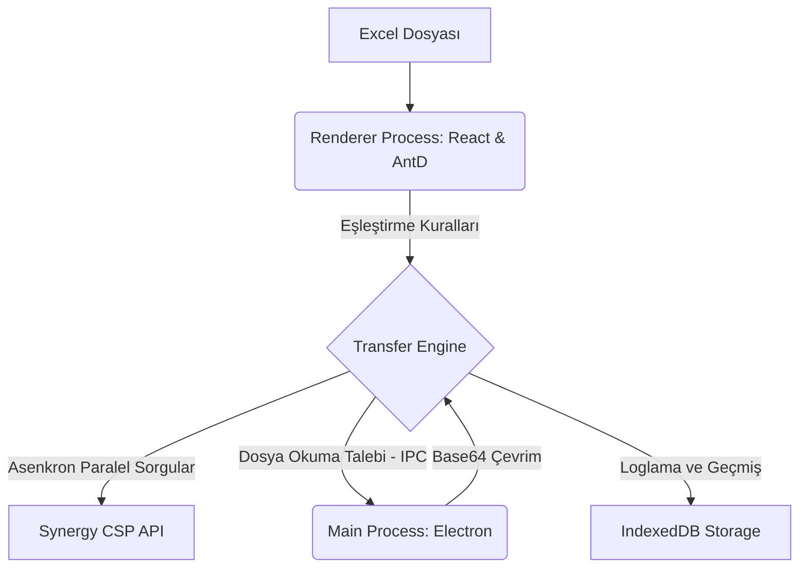

# Synergy CSP Relay 🚀

[](https://www.electronjs.org/)
[](https://react.dev/)
[](https://ant.design/)
[](#)

**Synergy CSP Relay**, Excel dosyalarındaki verileri analiz ederek dinamik alan eşleştirmeleriyle **Systek Synergy CSP** süreçlerine (Flow) ve formlarına (Form) yüksek performanslı, güvenli ve asenkron bir şekilde aktaran gelişmiş bir masaüstü entegrasyon uygulamasıdır.

Uygulama, **Electron**, **React (v19)** ve **Ant Design (v6)** mimarisi üzerine kurulu olup karmaşık veri ilişkilerini, alt grid aktarımlarını ve dosya eklerini (RelatedDocument) destekler.

---

## 📌 Öne Çıkan Özellikler

*   ⚡ **Bağımlılık Grafiği Tabanlı Eşzamanlı (Concurrent) Transfer**: Birbirine bağımlı form alanlarını akıllı bir şekilde analiz ederek bağımsız verileri paralel, bağımlı alanları ise sıralı çözen asenkron transfer mimarisi.
*   🧠 **Türkçe Destekli Akıllı Eşleştirme (Similarity Matching)**: API sorgularından dönen verileri, Levenshtein Distance algoritması ve Türkçe karakter normalizasyonu (İ/ı, Ş/s vb.) kullanarak %90 üzeri benzerlik eşiğiyle otomatik eşleştirme.
*   📊 **Çoklu Sheet ve Grid Desteği**: Excel'deki ana sheet dışında ilişkili diğer tablolardaki alt verileri dinamik olarak okuyarak CSP üzerindeki `InlineGrid` ve `RelatedGrid` nesnelerine otomatik eşleme.
*   📂 **Dosya Eki Entegrasyonu (`RelatedDocument`)**: Yerel dosya yollarını okuyarak Base64 formatına çeviren ve CSP formundaki ek döküman alanlarına doğrudan yükleyen arka plan IPC modülü.
*   🛡️ **RAM Güvenliği ve Dayanıklılık**: Aktarım loglarını tarayıcı bellek sınırlarına takılmadan saklamak için **IndexedDB** entegrasyonu ve olası hata durumlarında RAM çökmesini önleyen sınırlı in-memory fallback mekanizması.
*   🔄 **Gelişmiş Duraklatma / Devam Etme & Hata Tekrarlama**: Aktarımı dilediğiniz an durdurma, devam ettirme ve aktarılamayan (sistem veya doğrulama hatası alan) satırları seçip tekrar çalıştırma.

---

## 🏗️ Sistem Mimarisi

Uygulama, arayüz (Renderer) ve işletim sistemi seviyesindeki işlemleri yöneten (Main) çift süreçli asenkron bir mimariye sahiptir.



---

## 🛠️ Kurulum ve Çalıştırma

### Gereksinimler

*   [Node.js](https://nodejs.org/) (v18 veya üzeri önerilir)
*   npm veya yarn paket yöneticisi

### Geliştirme Modunda Çalıştırma

1.  Projeyi klonlayın ve klasöre gidin:
    ```bash
    git clone https://github.com/systek-mehmet/csp-relay.git
    cd csp-relay
    ```

2.  Bağımlılıkları yükleyin:
    ```bash
    npm install
    ```

3.  Uygulamayı geliştirme (development) modunda başlatın:
    ```bash
    npm run dev
    ```

### Üretim Paketi Oluşturma (Build)

Uygulamayı Windows için paketleyip kurulabilir `.exe` haline getirmek için:

```bash
npm run build:win
```

Oluşturulan kurulum dosyaları `dist/` klasörü altında yer alacaktır.

---

## 📖 Kullanım Kılavuzu

### 1. Bağlantı Ekranı
Uygulama açıldığında ilk olarak bağlanmak istediğiniz **Synergy CSP** ortamının `Domain URL` bilgisini girin.

### 2. Giriş ve Kimlik Doğrulama
Kullanıcı adı, şifre ve dil seçimini yaparak sisteme giriş yapın. Arka planda güvenli şifrelenmiş kimlik doğrulama tokenları (`bimser-encrypted-data` vb.) otomatik saklanır.

### 3. Proje ve Akış Seçimi
Aktarım yapmak istediğiniz CSP Projesini ve ardından hedef **Süreci (Flow)** veya **Formu (Form)** seçin.

### 4. Excel Yükleme ve Alan Eşleme
Excel dosyanızı yükleyin. Sütunların CSP formundaki hangi alanlara karşılık geleceğini (Excel Sütunu, Sabit Değer veya API Sorgusu olarak) yapılandırın.

### 5. İzleme ve Yürütme
Aktarımı başlatın. Süreç boyunca her bir satırın durumunu (Başarılı, Uyarı, Hata) canlı olarak izleyebilir, detaylı istek/cevap (Payload & Response) ağacını ve diagnostics analizlerini inceleyebilirsiniz.

---

## 🔒 Güvenlik ve Performans Notları

*   **Güvenli Alan Yönetimi**: Hassas kimlik bilgileri, arayüz süreçlerinde asla açık olarak loglanmaz ve IndexedDB veritabanında saklanmaz.
*   **İşlem Sınırlandırması (Concurrency Limit)**: Sunucunun aşırı yük altında kalmasını (rate-limiting) engellemek amacıyla paralel istekler 5'li chunk'lar halinde sınırlandırılmıştır.

---

## 👥 Geliştiriciler & Katkıda Bulunanlar

*   **Systek** bünyesinde **ATASEVEN** tarafından geliştirilmiştir.
*   İletişim & Detaylar: [ataseven.dev](https://ataseven.dev)
