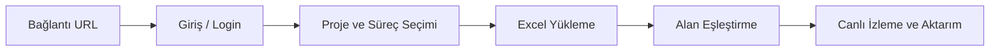

# Synergy CSP Relay - Detaylı Kullanım ve Yapılandırma Kılavuzu 📖

Bu kılavuz, **Synergy CSP Relay** uygulamasını kullanarak Excel verilerinizi Systek Synergy CSP ortamına nasıl aktaracağınızı, alan eşleştirmelerini (Mapping) ve gelişmiş parametre tanımlamalarını nasıl yapacağınızı detaylı olarak açıklamaktadır.

---

## 🚀 1. Genel Kullanım Akışı

Uygulamanın kullanımı adım adım şu şekildedir:



### Adım 1: Bağlantı
Uygulamayı açtığınızda önünüze gelen bağlantı ekranına, hedef Synergy CSP ortamının tam `Domain URL` adresini girin (Örn: `https://csp.sirketiniz.com`).

### Adım 2: Giriş
Kullanıcı adı, şifre ve dil seçimini girin. Başarılı girişte oturum tokenları otomatik saklanır ve bir sonraki adıma yönlendirilirsiniz.

### Adım 3: Excel Dosyası Yükleme
Aktarımını yapmak istediğiniz Excel dosyasını (.xlsx, .xls) seçip uygulamaya yükleyin. Yükleme sonrası Excel sayfaları (Sheet'ler) ve kolonları otomatik olarak analiz edilir.

---

## 🛠️ 2. Alan Eşleştirme (Mapping) Tipleri

Excel kolonlarındaki verilerin CSP formundaki karşılıklarına nasıl yazılacağını 3 farklı yöntemle belirleyebilirsiniz:

### A. Excel Sütunu (Excel Column)
Excel dosyanızdaki belirli bir sütundaki veriyi doğrudan form alanına yazar.
*   **Örnek**: Excel'deki `MusteriAdi` sütununu CSP formundaki `txt_MusteriIsmi` alanına doğrudan eşleme.

### B. Sabit Değer (Constant Value)
Excel'deki satır verilerinden bağımsız olarak, CSP formundaki alana her satır için aynı sabit değeri yazar.
*   **Örnek**: Formdaki `txt_Durum` alanına her aktarımda doğrudan `Aktif` veya `1` değerinin yazılması.

### C. API Sorgusu (API Lookup)
Excel'deki bir verinin (örneğin müşteri kodu veya departman adı) CSP sistemindeki karşılığını (örneğin benzersiz UUID/ID değeri) bulmak için dinamik API sorguları yapar.
*   **Nasıl Çalışır?**:
    1.  **API URL**: Karşılığı aranacak CSP servisinin adresi girilir (Örn: `/api/web/CustomService/GetDepartmanlar`).
    2.  **Display Format (Görüntüleme Şablonu)**: API'den dönen listedeki hangi alanın kullanıcıya gösterilen metin olduğu belirlenir. (Örn: `{{Name}}` veya `{{Kod}} - {{Ad}}`).
    3.  **Search Param Key (Arama Parametresi)**: Excel verisini API'ye gönderirken hangi anahtarla göndereceğinizi belirler (Örn: `searchText`).
    4.  **Response Path (Sonuç Yolu)**: API cevabındaki nesne dizisi yolu girilir (Örn: `result.result` veya `result`).
    5.  **Similarity Matching (Türkçe Uyumlu Benzerlik Eşleştirme)**: Sistem, API'den dönen kayıtlar ile Excel'deki hücre verisini karşılaştırır. Türkçe karakter farklarını normalleştirerek Levenshtein Distance algoritmasıyla en yakın sonucu (%90 üzeri başarı) bulup ID'sini otomatik eşleştirir.

---

## ⛓️ 3. Süreç ve Form Parametresi Tanımlama (Parameters Setup)

CSP formlarının ihtiyaç duyduğu parametreleri ve değişkenleri dinamik şablon formatı kullanarak tanımlayabilirsiniz.

### Dinamik Token / Değişken Kullanımı
Veri aktarımı sırasında her bir satırın kendi hücre değerlerini parametrelere enjekte etmek için çift süslü parantez `{{SutunAdi}}` sözdizimini kullanabilirsiniz.
*   **Senaryo**: Excel dosyanızda `Eposta` ve `Isim` sütunları olduğunu varsayalım.
*   **Parametre Yapısı**:
    ```json
    {
      "Gonderen": "Entegrasyon Sistemi",
      "KullaniciMail": "{{Eposta}}",
      "KullaniciIsim": "{{Isim}}"
    }
    ```
*   **Çalışma Anı**: Sistem her satırı işlerken `{{Eposta}}` ve `{{Isim}}` ifadelerini o satırdaki hücre değerleriyle otomatik olarak değiştirerek nihai veriyi oluşturur.

---

## 📊 4. Grid Yapılandırmaları (InlineGrid & RelatedGrid)

Uygulama, Excel dosyalarındaki alt detay tablolarını (örneğin bir faturanın kalemleri) CSP üzerindeki Grid alanlarına aktarabilir.

### A. InlineGrid (Form İçi Tablo)
CSP formu üzerinde doğrudan bulunan, ayrı bir döküman kimliği olmayan satır bazlı tablolar.
- **Master Key (Anahtar Sütun)**: Ana sayfa ile detay sayfası arasındaki ilişkiyi kuran ortak kolon (Örn: `FaturaNo`).
- Alt sheet'teki `FaturaNo` değerleri ile ana sheet'teki değerler eşleştirilerek grid satırları otomatik oluşturulur.

### B. RelatedGrid (İlişkili Döküman Tablosu)
CSP'de her bir satırı aslında arka planda başka bir form dökümanı olan, döküman kimliği (RelationDocumentId) ile bağlanan gelişmiş alt tablolar.
- **Asenkron Paralel Gönderim**: Bu grid türünde, alt satırların her biri CSP API'sine ayrı birer form olarak kaydedilmek zorundadır. Uygulamamız bu satırları **5'li gruplar halinde paralel** göndererek performansı maksimuma çıkarır.
- Alt formlar başarıyla oluşturulup `RelationDocumentId` değerleri alındıktan sonra ana form ile otomatik ilişkilendirilir.

---

## 📂 5. Dosya Eki Entegrasyonu (`RelatedDocument`)

Formunuzda dosya yükleme alanları (Attachment) varsa, yerel diskteki dosya yollarını doğrudan CSP'ye aktarabilirsiniz.
*   **Sütun Eşleştirme**: Excel'de dosyanın yerel yolunu (Örn: `C:\Belgeler\Fatura_102.pdf`) tutan sütun seçilir.
*   **IPC Çalışması**: Electron ana süreci (Main Process) işletim sistemi seviyesinde dosyayı okur, Base64 formatına dönüştürür ve döküman adı, uzantısı ve boyutuyla birlikte CSP API'sine güvenli bir şekilde aktarır.

---

## 🚦 6. Hata Yönetimi ve Log Okuma

Aktarım esnasında canlı akış tablosundan (Log Viewer) işlemler izlenebilir:
- **System Error (Sistem Hatası)**: Sunucu bağlantı hatası veya ağ kopması durumlarında oluşur.
- **Validation Error (Doğrulama Hatası)**: CSP formundaki zorunlu alanların boş bırakılması veya geçersiz değer girilmesi durumunda CSP sunucusunun döndüğü hata.
- **Hata İnceleme & Retry**:
  - Hata alan herhangi bir satırın üzerine çift tıklayarak **gönderilen ham payload (istek)** ve **gelen ham cevabı (response)** detaylı olarak inceleyebilirsiniz.
  - Sadece hata alan veya yarıda kalan satırları seçip **Retry (Yeniden Dene)** butonu ile tüm aktarımı baştan başlatmadan sadece hatalıları tekrar çalıştırabilirsiniz.
